# 基于多物理场仿真与机器学习的钨温控部件拓扑优化技术报告

## 项目速览

*表 0-1 最终候选与圆柱基线对比*

| 对比项 | 均匀圆柱基线 | 圆柱簇最优可行解 | zigzag 最优可行解 |
|---|---:|---:|---:|
| 结构类型 | 圆柱基线 | 8 段圆柱簇 | 长路径折返拓扑 |
| trial 编号 | - | 122 | 21 |
| 核心参数 | `r=2.500 mm` | `[r1,r2,r3,r4]=[1.592,3.706,1.737,2.391] mm` | `N_RUNS=10, L_RUN=99.53 mm, z_first=2.04 mm, side=0.522 mm` |
| Vwork | 0.6348 V | 0.9766 V | 100 V |
| initialTmax | 3196.2 K | 3270.0 K | 2978.0 K |
| lifetimeH | 115.50 h | 35.27 h | 82.39 h |
| lifeAvgP03sphere_W | 428.57 W | 559.64 W | 2848.70 W |
| 相对圆柱基线提升 | 0% | +30.58% | +564.8% |
| 是否满足寿命约束 | 是 | 是 | 是 |

## 1. 问题理解

### 1.1 赛题目标

赛题要求从直径 5 mm、高度 15 mm 的纯钨圆柱坯料出发，在一定的约束条件下，实现目标函数的最大化。因此，本文将该问题建模为小样本、强约束的几何参数优化问题，并引入机器学习方法辅助搜索。

| 优化目标 | 约束条件                               |
|---|---|
| 初始 0-3 um 外接球净辐射功率尽可能大 | 体积守恒、电极位置固定、结构保持整体性 |
| 生命周期平均 0-3 um 辐射功率尽可能大 | 最大电压不超100V、温度不超过3000摄氏度 |
| 寿命尽可能长（节约成本） | 寿命不能低于初始结构寿命的30%            |
| 最大化能量转换效率 | 特征尺寸变化大于20%即失效              |

### 1.2 整体思路

1. 确定静态工作点：在COMSOL建立符合赛题要求的各项物理模型（详见第二章物理模型），搜索满足温度上限的最高工作电压，并在该电压下推进退蚀寿命循环，输出生命周期0到3微米平均辐射功率、寿命等相关指标。
2. 机器学习分析：采用贝叶斯优化在有限仿真预算内搜索几何参数，并用随机森林和 SHAP 解释主要设计规律。
3. 拓扑扩展：进一步研究 zigzag 型变体，并通过与圆柱簇的对比确定最终候选结构。

初赛阶段已经完成圆柱簇的 150 组贝叶斯搜索和zigzag型的贝叶斯搜索，得到了可复现的实验数据集（见上传压缩包）。赛题初始拓扑形态基线寿命为 115.50 h ，寿命硬约束下限为 34.65 h。以圆柱簇为例，我们得到满足寿命约束的最优圆柱簇生命周期平均 0-3 um 外接球净辐射功率为 559.64 W，相对基线 428.57 W 提升 30.58%。结果表明，在有限仿真预算下，该流程已经获得明显性能提升，也符合企业命题对轻量化验证方案的需求。

### 1.3 我们为什么想到zigzag型变体

除圆柱簇优化方案外，本文进一步提出 zigzag 型拓扑结构。

我们从圆柱簇转向 zigzag 型，原因是圆柱的拓扑自由度仍然有限：本质上只是沿轴向重新分配截面积，主要通过局部细颈提高电阻和温度，从而增强 0-3 um 辐射输出。这样的策略很快会受到寿命约束限制，因为细颈区域温度高、蒸发速率呈指数上升，最优解往往贴近寿命下限。

zigzag 型则提供了另外一种思路：在保持总体积和电极相对位置不变的前提下，将导电路径折返拉长。路径变长会提高整体电阻，使结构能在同样的电压偏置下形成更有效的欧姆热沉积。同时，等体积条件下截面变细、外表面积显著增加，有利于提高对外辐射面积和 0-3 um 净辐射功率。相比圆柱簇只是在原轴向圆柱上做半径重分配，zigzag 实际上引入了长路径、大表面积、自遮挡可控的新拓扑机制，因此更接近赛题希望探索的创新三维拓扑方向。

该构型也受到经典灯泡钨丝的工程经验启发：在材料体积有限、温度受限的条件下，通过延长导电路径和提高有效辐射面积，可以在功率输出和寿命之间取得更优折中。

zigzag 型的具体参数化和优化结果将在 3.3 节与 4.5 节详细说明。4.6 节系统对比 zigzag 簇最优模型与圆柱簇最优模型，结果显示 zigzag 最优模型的生命周期平均 P03 功率约为圆柱簇最优模型的 5 倍，寿命也更长。

## 2. 物理模型

我们通过COMSOL把钨棒视为一个电热辐射体：输入端施加电压、输出端接地，电流通过钨结构产生焦耳热，热量再通过导热与表面辐射达到稳态。每一次几何退蚀后，模型都会重新求解电场、温度场和辐射功率，因此寿命过程不是一次性静态估算，而是涵盖稳态求解、表面退蚀、几何更新的循环。

### 2.1 温度相关材料参数

钨的材料参数随温度变化。密度取 $\rho=19350\ \mathrm{kg/m^3}$，电阻率、热导率和比热容采用工程拟合：

$$
\rho_e(T)=5.5\times10^{-8}\left[1+0.003836(T-293.15)+7.55\times10^{-7}(T-293.15)^2\right]\ \Omega\cdot\mathrm m
$$

$$
k(T)=\max\left(75,\ 175-0.032(T-293.15)\right)\ \mathrm{W/(m\cdot K)}
$$

$$
C_p(T)=\min\left(195,\ 132+0.020(T-293.15)\right)\ \mathrm{J/(kg\cdot K)}
$$

这样处理的原因是：钨在高温下电阻明显上升、导热能力下降，若使用常数材料，会低估局部热点和寿命退化风险。相关趋势与 Tolias 等高温钨热物性整理以及 NIST/NBS 钨热物性资料一致。本文不对不同候选结构分别调参，圆柱簇、zigzag 簇和基线结构均采用同一组温度相关材料公式，从而保证形状之间的相对比较口径一致。

### 2.2 电热耦合

电场部分求解稳态导电问题。设电势为 $V$，电导率为 $\sigma_e(T)=1/\rho_e(T)$，则：

$$
\nabla\cdot\left(\sigma_e(T)\nabla V\right)=0,\qquad \mathbf J=-\sigma_e(T)\nabla V
$$

导电产生的焦耳热作为热源进入传热方程：

$$
q_J=\mathbf J\cdot\mathbf E=\sigma_e(T)|\nabla V|^2
$$

稳态温度场由导热、焦耳热和表面辐射共同决定：

$$
\nabla\cdot(k(T)\nabla T)+q_J=0
$$

边界上通过 S2S 面-面辐射给出辐射散热。

### 2.3 工作电压搜索策略

赛题限制最大外加电压不超过 $100\ \mathrm V$，同时要求最高温度不超过 $3273.15\ \mathrm K$。因此每个候选几何都先确定静态工作电压 $V_\mathrm{work}$，再进入后续退蚀寿命循环。我们的电压搜索目标可以写成：

$$
V_\mathrm{work}=\max V,\qquad
0<V\le100\ \mathrm V,\qquad T_\mathrm{max}(V)<3273.15\ \mathrm K
$$

具体执行时，先尝试 $100\ \mathrm V$。若该电压下温度、电流和体积校验均满足要求，则直接取 $V_\mathrm{work}=100\ \mathrm V$。若出现超温，则根据焦耳热近似比例关系给出一个初始降压估计：

$$
V_\mathrm{guess}=100\sqrt{\frac{3273.15}{T_\mathrm{max}(100\ \mathrm V)}}
$$

随后用二分搜索在可行电压和不可行电压之间收敛，直到电压区间小于 $0.05\ \mathrm V$。每次电压试算都重新求解稳态电场、温度场和 S2S 辐射场，并读取最高温度、输入电流、体积误差和辐射功率。确定 $V_\mathrm{work}$ 后，生命周期退蚀循环在该工作电压下推进，保证不同几何候选在统一的物理口径下比较。

### 2.4 双波段 S2S 辐射

赛题最主要的优化目标是生命周期平均 $0-3\ \mu\mathrm m$ 辐射功率，因此辐射不能只用单一灰体发射率描述。根据要求我们将辐射分成两个波段：

$$
\varepsilon(\lambda)=
\begin{cases}
\varepsilon_{03}=0.35, & 0\le \lambda<3\ \mu\mathrm m \\
\varepsilon_\mathrm{rest}=0.15, & \lambda\ge 3\ \mu\mathrm m
\end{cases}
$$

设 $f_{03}(T)$ 为黑体在 $0-3\ \mu\mathrm m$ 波段内的能量占比，由 Planck 积分的级数近似计算。$\sigma=5.670374419\times10^{-8}\ \mathrm{W/(m^2K^4)}$，环境温度 $T_\mathrm{amb}=293.15\ \mathrm K$。局部 $0-3\ \mu\mathrm m$ 净辐射通量为：

$$
q_{03}=\varepsilon_{03}\sigma\left[f_{03}(T)T^4-f_{03}(T_\mathrm{amb})T_\mathrm{amb}^4\right]
$$

全波段局部净辐射通量为：

$$
q_\mathrm{rad}=\sigma\left\{\varepsilon_\mathrm{rest}(T^4-T_\mathrm{amb}^4)+(\varepsilon_{03}-\varepsilon_\mathrm{rest})\left[f_{03}(T)T^4-f_{03}(T_\mathrm{amb})T_\mathrm{amb}^4\right]\right\}
$$

前期对比测试表明，若用单一全波段发射率（值为0.32）替代双波段模型，均匀圆柱基线寿命会产生很大偏差，因此本文保留双波段 S2S 辐射作为核心模型。

### 2.5 外接球功率与自身遮挡

赛题最终统计的是外接球接收到的有效辐射功率。复杂拓扑直接做外接球积分计算成本较高，因此我们采用能量守恒缩放方法：

$$
P_{\mathrm{rad,sphere}}=V_\mathrm{work}|I_\mathrm{in}|
$$

$$
P_{03,\mathrm{sphere}}=P_{\mathrm{rad,sphere}}\cdot
\frac{P_{03,\mathrm{surface}}}{P_{\mathrm{rad,surface}}}
$$

$$
\mathrm{selfViewLoss}=
\left(1-\frac{P_{03,\mathrm{sphere}}}{P_{03,\mathrm{surface}}}\right)\times100\%
$$

其中 $P_{03,\mathrm{surface}}$ 和 $P_{\mathrm{rad,surface}}$ 来自部件表面积分。对凸圆柱而言，理论自身遮挡接近 0。

### 2.6 退蚀寿命模型

寿命由高温表面退蚀控制。赛题给出的表面质量损失率为：

$$
\gamma(T)=A\exp\left(-\frac{B}{T}\right),\qquad
A=3.9\times10^9\ \mathrm{kg/(m^2s)},\quad B=1.023\times10^5\ \mathrm K
$$

圆柱簇中，每段半径按表面温度驱动退蚀：

$$
\frac{\mathrm dr_i}{\mathrm dt}=\frac{\gamma(\bar T_i)}{\rho}
$$

zigzag 方截面结构中，退蚀等效为截面边长收缩，双侧表面同时退蚀，因此采用：

$$
\frac{\mathrm ds_i}{\mathrm dt}=\frac{2\gamma(\bar T_i)}{\rho}
$$

当任一关键截面损失达到初始尺寸的 20% 时，认为结构达到寿命终点。每个退蚀步之后，几何、网格、电流、温度和辐射功率都会重新计算，本质上就是几何形变的接口。

### 2.7 表面平均温度口径

圆柱簇采用每段侧面的面积加权平均温度：

$$
\bar T_i=\frac{\int_{S_i}T\,\mathrm dA}{\int_{S_i}\mathrm dA}
$$

该统计方法让圆柱簇退蚀由真实侧面温度驱动。对比计算显示，在均匀圆柱基线中，将退蚀温度从抛物线近似改为表面面积平均后，寿命从 85.73 h 提高到 115.50 h，说明温度取样方式对寿命评估非常敏感。

zigzag 簇当前采用更轻量化的块中心高度近似温度。具体做法是：每次稳态求解后读取全局最高温度 $T_\mathrm{max}$ 和最低温度 $T_\mathrm{min}$，再根据每个折线块中心高度 $z_i$ 构造轴向抛物线温度分布：

$$
\eta_i=\frac{z_i}{L_0},\qquad
\bar T_i=T_\mathrm{min}+
(T_\mathrm{max}-T_\mathrm{min})\,4\eta_i(1-\eta_i)
$$

其中 $L_0=15\ \mathrm{mm}$。该近似反映了通电钨结构通常在中部温度更高、端部因电极接触而较冷的基本趋势，能够在有限计算预算内完成 zigzag 长路径结构的大量寿命搜索。需要说明的是，zigzag 当前尚未像圆柱簇那样为每个折线块建立独立侧面选择集并做 `IntSurface` 面积积分。复赛阶段将把 zigzag 退蚀温度口径升级为逐块侧面面积加权平均温度，以进一步提高寿命评估精度。

### 2.8 网格与求解一致性

本阶段的目标是对候选拓扑进行同一口径下的相对比较，因此所有候选结构均采用统一的 COMSOL 建模链路：相同的温度相关钨材料参数、相同的 S2S 双波段辐射设置、相同的最高温度约束、相同的电压搜索精度和相同的生命周期退蚀判据。圆柱簇和 zigzag 簇在每次几何更新后都会重新生成网格并重新求解稳态电热辐射耦合问题，避免沿用旧几何下的温度场或电流场。

网格方面，圆柱簇采用统一的自由四面体网格设置；zigzag 簇由于几何长细比更大，也采用统一自动网格策略并对失败几何进行剔除。S2S view factor、稳态求解器、电压二分搜索和结果积分均保持固定流程。本文报告的最优排序只在该统一数值口径下比较，不把不同网格策略或不同求解容差混入同一组性能结论。

## 3. 算法设计

### 3.1 项目代码链路

当前圆柱簇和 zigzag 分支的主要文件如下：

| 模块 | 文件 | 作用 |
|---|---|---|
| 圆柱簇 baseline | `cylinder_family/src/cylinder_baseline.java` | 圆柱簇COMSOL实测基线 |
| 圆柱簇 Python 求解器 | `cylinder_family/ML/comsol_runner.py` | 圆柱簇单次 trial 评估 |
| 圆柱簇优化器 | `cylinder_family/ML/optuna_optimize.py` | Optuna TPE 贝叶斯搜索 |
| 圆柱簇结果解析 | `cylinder_family/ML/parse_results.py` | 收敛曲线、Pareto、参数分布图 |
| 圆柱簇机器学习分析 | `cylinder_family/ML/surrogate_analysis.py` | RF 代理模型、SHAP 分析、代理候选 |
| zigzag baseline | `zigzag_family/zigzag_baseline.java` | 折线簇COMSOL实测基线 |
| zigzag Python 求解器 | `zigzag_family/ML/zigzag_runner.py` | 折线簇单次 trial 评估 |
| zigzag 优化器 | `zigzag_family/ML/optuna_optimize.py`        | Optuna TPE 贝叶斯搜索            |
| zigzag 结果解析 | `zigzag_family/ML/parse_results.py` | 收敛曲线、Pareto、参数分布图 |
| zigzag 机器学习分析 | `zigzag_family/ML/surrogate_analysis.py` | RF 代理模型、SHAP 分析、代理候选 |

baseline 用于建立后续优化模型的标准对照组。Python版本用于长时间批量优化。二者不是两套物理口径，而是同一物理流程的两种执行方式。整体运行链路为：Java baseline 校验物理模型、Python runner 批量调用 COMSOL、Optuna 记录 trial、parse_results 输出结果图、surrogate_analysis 做 RF/SHAP 解释。

### 3.2 圆柱簇参数化

圆柱簇将 15 mm 钨棒划分为 8 个等长轴向段，每段长度 1.875 mm。考虑几何与电极边界近似对称，优化变量写作：

\[
\mathbf r=[r_1,\ r_2,\ r_3,\ r_4,\ r_4,\ r_3,\ r_2,\ r_1]
\]

原始半径 \(r_0=2.5\ \mathrm{mm}\)，体积守恒为：

\[
2\left(r_1^2+r_2^2+r_3^2+r_4^2\right)=8r_0^2
\]

\[
r_4=\sqrt{4r_0^2-r_1^2-r_2^2-r_3^2}
\]

Optuna 批量优化器实际采样 \(r_1/r_2/r_3\)，\(r_4\) 由体积守恒可以得到。搜索范围为 \([0.8,\ 4.5]\ \mathrm{mm}\)，条件边界保证 \(r_4\) 也处于可行范围。

### 3.3 zigzag 折线簇参数化

zigzag 分支面向更高辐射功率的长路径拓扑，核心思想是在保持总体积和电极位置不变的前提下，把导电路径折返拉长，使等体积截面变细、总外表面积增大，并在 100 V 最大电压口径下获得更高电阻和更高辐射输出。

zigzag 分支采用的主要特征值如下：

| 参数 | 说明 |
|:---:|:---:|
| `N_RUNS` | 水平折返段数 |
| `L_RUN_mm` | 每段水平长度 |
| `z_first_mm` | 第一段 z 坐标，\(z_\mathrm{last}=L_0-z_\mathrm{first}\) |
| `side_mm` | 由总体积守恒和路径长度反算得到的方截面边长 |

该参数化保留了赛题要求的体积守恒、电极位置固定与结构连通性，同时把路径长度和有效辐射面积显式纳入搜索空间，为后续更高自由度拓扑优化提供了可解释的几何标准。

### 3.4 优化目标与约束处理

优化目标：

\[
\max\ \mathrm{lifeAvgP03sphere\_W}
\]

其中 `lifeAvgP03sphere_W` 表示生命周期平均 0-3 um 外接球辐射功率，是本文所有候选结构排序的核心指标。

硬约束如下：

| 约束 | 实现方式 |
|:---:|:---:|
| 体积守恒 | 圆柱簇通过半径平方和保证。zigzag 通过路径长度反算截面边长 |
| 温度上限 | 要求稳态最高温度 \(T_\mathrm{max}<3273.15\ \mathrm{K}\) |
| 最大电压 | \(V_\mathrm{work}\le100\ \mathrm{V}\) |
| 寿命下限 | \(t_\mathrm{life}\ge34.65\ \mathrm{h}\)，即均匀圆柱寿命的 30% |
| 电极位置固定 | 输入/输出端面固定在 \(z=0\) 与 \(z=15\ \mathrm{mm}\) |
| 连通性 | 圆柱簇保持同轴连通。zigzag 保持折线路径连续 |

### 3.5 贝叶斯优化与可解释性

圆柱簇和 zigzag 簇均采用 Optuna TPE。原因是本问题维度低、评估昂贵、目标确定、约束可解析，适合样本高效的黑箱优化。完成批量 trial 后，进一步运行：

<code>python parse_results.py</code> 
<code>python surrogate_analysis.py</code>

得到优化历史、Pareto 前沿、平行坐标图、随机森林特征重要性和 SHAP 图。随机森林代理模型不替代 COMSOL 真值，只用于解释趋势和生成下一轮候选。圆柱簇主要解释半径重分配规律，zigzag 簇主要解释折返长度、折返段数与寿命/功率之间的关系。

随机森林代理模型用于在已有仿真样本上提取几何参数与性能指标之间的统计关系。COMSOL 每完成一组 trial，都会得到对应几何参数、寿命、平均 0-3 um 辐射功率和温度等指标。代理模型主要承担三类工作：一是用特征重要性和 SHAP 分析判断哪些几何变量对功率和寿命影响最大；二是在不额外调用 COMSOL 的情况下，对未仿真的参数区域给出近似判断，辅助下一轮局部加密搜索；三是帮助识别功率提升与寿命约束之间的取舍关系。最终候选排序仍以 COMSOL 生命周期仿真结果为准，随机森林只作为低成本解释和辅助决策工具。

## 4. 求解结果

### 4.1 基线对齐

以圆柱簇为例： baseline 由 COMSOL Java Shell 直接运行 `cylinder_family/src/cylinder_baseline.java` 得到。而Python 的 `COMSOL_runner.py` 用于批量优化。我们为了保证在COMSOL中运行java代码和批量运行python的结果一致，我们验证了两种运行方式的baseline输出结果：

| 指标 | Java baseline | Python Trial 0 | Python - Java |
|---|---:|---:|---:|
| `Vwork_V`（满足温度约束下的工作电压） | 0.634766 | 0.634765625 | -3.75e-7 V |
| `initialTmax_K`（初始稳态最高温度） | 3196.2 | 3196.221753 | +0.0218 K |
| `lifetimeH`（退蚀到失效阈值的寿命） | 115.5040 | 115.503704 | -0.000296 h |
| `initialP03sphere_W`（初始 0-3 um 外接球辐射功率） | 504.07 | 504.071038 | +0.00104 W |
| `initialPradSphere_W`（初始全波段外接球辐射功率） | 527.83 | 527.833899 | +0.00390 W |
| `lifeAvgP03sphere_W`（生命周期平均 0-3 um 外接球辐射功率） | 428.57 | 428.572742 | +0.00274 W |
| `lifeAvgPradSphere_W`（生命周期平均全波段外接球辐射功率） | 449.77 | 449.771920 | +0.00192 W |
| `selfViewLoss_pct`（自遮挡损失比例） | -5.66 | -5.654903 | +0.00510 pct point |
| `failureReached`（是否达到退蚀失效判据） | true | true | 一致 |
| `erosionSteps`（生命周期退蚀宏步数） | 13 | 13 | 一致 |

寿命差异约 1.07 s，生命周期平均 0-3 um 辐射功率差异约 0.0027 W，远小于优化样本之间的性能差异。

因此后续 150 组 Optuna 结果可以视为与 Java baseline 同一物理口径下的批量评估结果，从而侧面验证了我们的优化链路是正确的。

### 4.2 圆柱簇 150 组优化结果

满足寿命约束的最优为 Trial 122：

| 指标 | Baseline | Trial 122 |
|---|---:|---:|
| 半径前 4 段 (mm) | `[2.500, 2.500, 2.500, 2.500]` | `[1.592, 3.706, 1.737, 2.391]` |
| 完整半径 (mm) | `[2.5,2.5,2.5,2.5,2.5,2.5,2.5,2.5]` | `[1.592,3.706,1.737,2.391,2.391,1.737,3.706,1.592]` |
| `Vwork` | 0.6348 V | 0.9766 V |
| 初始 `Tmax` | 3196.2 K | 3270.0 K |
| 寿命 | 115.50 h | 35.27 h |
| 初始 `P03sphere` | 504.07 W | 635.88 W |
| 生命周期平均 `P03sphere` | 428.57 W | 559.64 W |
| 相对提升 | 0% | +30.58% |

若仅追求功率输出，搜索会继续向更高温、更短寿命区域推进。加入 30% 基线寿命硬约束后，Trial 122 成为当前最优可行解，体现出优化器能够在高辐射输出与寿命保持之间自动寻找折中边界。

### 4.3 Pareto 前沿

满足寿命约束的 Pareto 前沿前几项如下：

| Rank | Trial | 半径前 4 段 (mm) | AvgP03 (W) | 寿命 (h) | 相对基线 |
|---:|---:|---|---:|---:|---:|
| 1 | 122 | `[1.59, 3.71, 1.74, 2.39]` | 559.6 | 35.3 | +30.6% |
| 2 | 59 | `[1.60, 3.91, 1.73, 2.04]` | 548.2 | 44.1 | +27.9% |
| 3 | 102 | `[1.76, 3.66, 2.08, 2.04]` | 536.2 | 53.1 | +25.1% |
| 4 | 53 | `[1.65, 3.80, 1.62, 2.27]` | 531.0 | 63.0 | +23.9% |
| 5 | 143 | `[1.52, 3.88, 1.59, 2.26]` | 528.6 | 64.8 | +23.3% |

*表 4-3 圆柱簇可行 Pareto 前沿代表方案*

表中每一行都是满足寿命约束后的代表性可行设计。`AvgP03` 是赛题核心目标，即生命周期平均 0-3 um 外接球辐射功率。寿命列表示该结构从初始状态退蚀到失效判据所经历的时间。相对基线表示与均匀圆柱基线 428.57 W 相比的提升幅度。Pareto 前沿的含义是：如果一个方案已经在功率和寿命两个方向上都不比另一个方案差，并且至少一个指标更好，那么被比较方案就会被支配，不再是前沿点。因此，上表中的方案代表当前样本中不同功率-寿命折中的有效选择。

从表中可以看到，Trial 122 的寿命只有 35.3 h，接近 34.65 h 的约束下限，但功率最高。Trial 59、102、53、143 的功率略低，但寿命逐步增加。这说明圆柱簇优化并不是单纯追求最长寿命，而是在寿命刚满足赛题约束的前提下尽量提高 0-3 um 辐射功率。换言之，最优解主动利用了寿命约束边界，把材料工作点推到高温高辐射但仍可接受的区域。

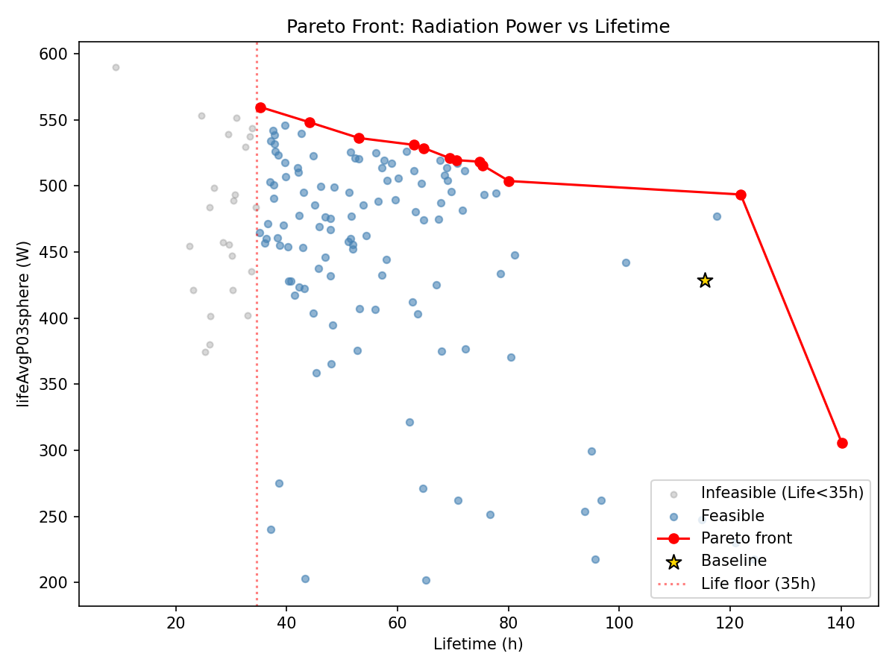

*图 4-1 圆柱簇寿命-功率 Pareto 前沿*

图 4-1 的横轴是寿命，纵轴是生命周期平均 0-3 um 外接球辐射功率。竖直虚线表示赛题寿命硬约束下限 34.65 h，虚线左侧的点即使功率很高，也因为寿命不足不能作为可行提交方案。虚线右侧的点是满足寿命约束的候选。红色连线表示当前样本中的 Pareto 前沿，代表在同等寿命附近功率更高或在同等功率附近寿命更长的方案集合。Trial 122 位于红色前沿的高功率端，说明它是当前圆柱簇中最能利用寿命边界换取辐射输出的设计。

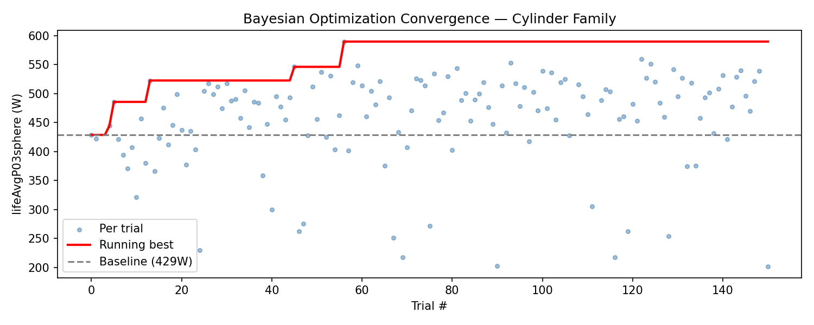

*图 4-2 圆柱簇贝叶斯优化收敛曲线*

图 4-2 的横轴是 trial 编号，纵轴是每个候选的目标函数值，即生命周期平均 0-3 um 外接球辐射功率。散点表示每次 COMSOL 评估的结果，红色曲线表示截至当前 trial 的历史最好值。可以看到，优化器早期主要进行全局探索，中后期逐渐把采样集中到高功率区域。历史最好值不是线性增长，而是通过少数关键 trial 跳升，这正是贝叶斯优化适合昂贵仿真的原因：不需要穷举所有组合，也能较快找到性能边界附近的结构。

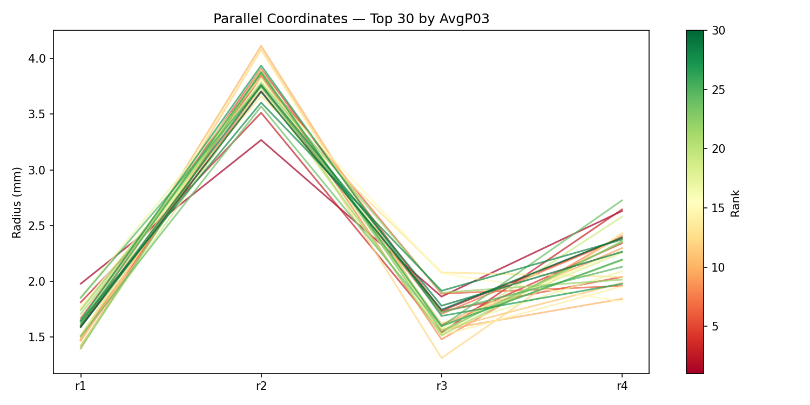

*图 4-3 圆柱簇高性能候选的平行坐标图*

图 4-3 用平行坐标展示高排名候选的半径组合。每一条折线代表一个候选结构，横向不同坐标轴对应 \(r_1/r_2/r_3/r_4\) 等参数，纵向归一化值表示该参数相对大小。高性能候选并没有表现为所有半径同时变小，而是呈现明显的粗细交替：部分细段提高电阻和局部温度，部分粗段承担导电、散热和寿命缓冲。这个图帮助我们从一组数值结果中提取出可解释的设计规律，而不仅仅停留在Trial 122 分数最高的结论。

### 4.4 圆柱簇结果解释

Trial 122 的策略可以概括为粗细交替的轴向电阻重分配：

1. \(r_1\)、\(r_3\) 较细，提高局部电阻和温度，使 0-3 um 辐射比例和总输出提高。
2. \(r_2\) 显著加粗，承担导电与散热缓冲作用，避免所有薄弱点同时高温失效。
3. \(r_4\) 由体积守恒约束派生，决定中心附近有效截面和剩余体积预算。
4. 工作电压从 0.6348 V 提高到 0.9766 V，但最高温度仍压在 3273.15 K 附近。
5. 由于蒸发率对温度呈指数敏感，最优解寿命接近 30% 下限，说明优化器正在主动利用寿命硬约束边界换取更高辐射功率。

从工程角度看，圆柱簇给出的不是越细越好，而是在寿命下限附近形成可控热点。这对后续 zigzag 或更高自由度拓扑有指导意义：应追求高电阻长路径和辐射有效面积，而不是无约束地制造极细颈部。

为进一步解释 Trial 122 为什么优于均匀圆柱，我们对 148 条圆柱簇完整样本训练随机森林代理模型，并用特征重要性和 SHAP 分析提取设计规律。这里需要特别说明：Optuna 实际独立采样的是 \(r_1/r_2/r_3\)，\(r_4\) 由体积守恒反算得到，并不是可独立调节的变量。\(r_4\) 仅作为派生几何量在候选结构表中展示。

基于独立变量 \(r_1/r_2/r_3\) 训练得到的 `lifeAvgP03sphere_W` 随机森林特征重要性如下：

| 特征 | 重要性 |
|---|---:|
| \(r_1\) | 0.671 |
| \(r_2\) | 0.219 |
| \(r_3\) | 0.110 |

该结果说明，在独立变量口径下，端部半径 \(r_1\) 对平均 0-3 um 辐射功率的影响最明显，其次为 \(r_2\) 和 \(r_3\)。这并不意味着 \(r_4\) 不重要，而是说明 \(r_4\) 的变化已经被体积守恒关系包含在 \(r_1/r_2/r_3\) 的组合变化中。换言之，\(r_4\) 更适合作为剩余体积预算和中心截面尺寸的派生结果来解释，而不应作为一个独立 SHAP 特征解释。

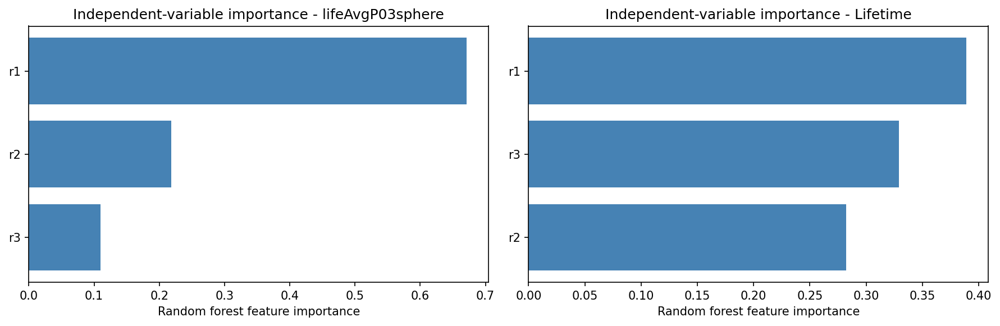

*图 4-4 圆柱簇随机森林特征重要性*

该图用于回答真实独立设计变量中，哪些变量最影响生命周期平均 0-3 um 辐射功率。从结果看，\(r_1\) 重要性最高，说明端部细化会显著改变整体电阻、端部热分布和有效辐射输出。\(r_2/r_3\) 则负责在中部提供导电缓冲和热点分布调节。由于 \(r_4\) 被排除在独立特征之外，图中的重要性更适合解释优化器真实可调的三个自由度。

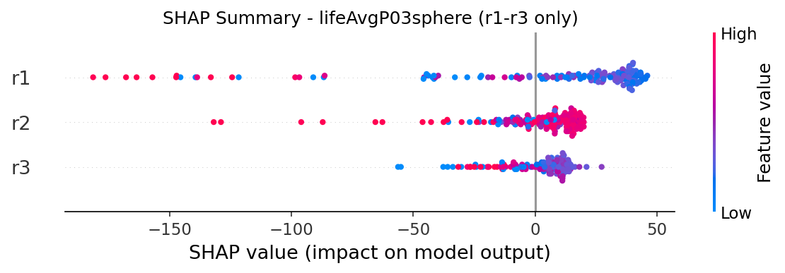

*图 4-5 圆柱簇 `lifeAvgP03sphere_W` 的 SHAP summary 图*

该图解释 \(r_1/r_2/r_3\) 的不同取值如何把目标函数推高或压低。横轴是 SHAP 值，越靠右表示越有利于提高生命周期平均 0-3 um 功率。颜色表示该特征取值大小。图中可以看到，高功率解不是所有独立半径同时减小，而是由端部细化、中段加粗和剩余体积分配共同形成粗细交替结构。

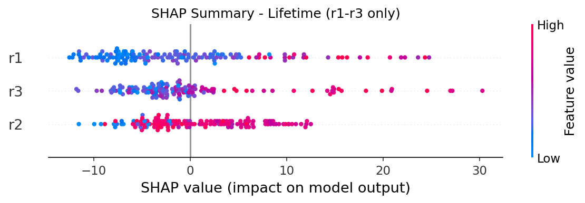

*图 4-6 圆柱簇 `lifetimeH` 的 SHAP summary 图*

寿命 SHAP 图用于判断哪些变量会加速或延缓退蚀失效。由于蒸发率对温度呈指数敏感，局部过细半径虽然有利于提高功率，但会明显缩短寿命。因此圆柱簇最优解不是越细越好，而是在高功率和寿命下限之间寻找边界解。

轻量差分进化在 RF 代理上给出的寿命约束候选为：

\[
\begin{aligned}
{}[r_1,r_2,r_3,r_4] &= [1.474,\ 3.856,\ 1.609,\ 2.317]\ \mathrm{mm} \\
\mathbf r_\mathrm{full} &= [1.474,\ 3.856,\ 1.609,\ 2.317,\ 2.317,\ 1.609,\ 3.856,\ 1.474]\ \mathrm{mm} \\
\widehat{AvgP03} &= 527.9\ \mathrm{W} \\
\widehat{Lifetime} &= 41.6\ \mathrm{h}
\end{aligned}
\]

该候选与 Trial 122 落在相同的粗细交替设计区域，说明代理模型与真实 COMSOL 搜索给出了相互一致的设计方向。它的预测功率低于 Trial 122，但预测寿命更保守，因此更适合作为下一轮局部加密搜索的参考点。当前最优仍采用真实 COMSOL 仿真的 Trial 122。

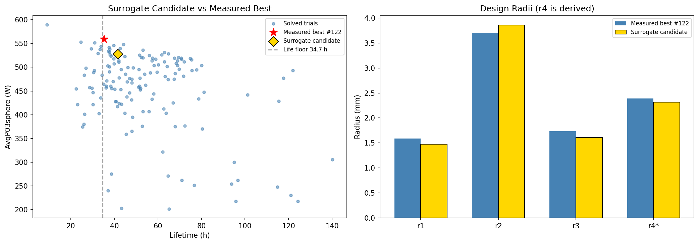

*图 4-7 圆柱簇代理模型候选与真实最优候选对比*

该图用于比较真实 COMSOL 搜索最优解和代理模型建议候选。右侧半径对比中 \(r_4^*\) 表示由体积守恒反算得到的派生半径，不是独立输入特征。两者半径模式接近，说明 RF 代理模型并没有学到完全偏离物理直觉的方向，而是在真实高性能区域附近给出进一步加密搜索建议。

### 4.5 zigzag 折线簇结果

本文将 zigzag 基线人为设定为 `N_RUNS=8, L_RUN=104 mm, z_first=0.8 mm`，路径总长约 846 mm，方截面边长约 0.570 mm。COMSOL 验证得到寿命 7.1277 h、初始 `P03sphere` 约 3711 W，说明长路径结构具有很强的初始辐射能力，但该参考结构寿命低于圆柱基线 30% 的约束下限，因此只作为高功率拓扑参考，不作为可行提交解。

zigzag 参数搜索已完成 150 组 trial，其中 136 组具有可用于后处理的完整指标，状态统计为 60 组满足寿命硬约束、87 组因寿命不足被剪枝、3 组因几何重叠被判为不可行。全部可用样本累计代表约 19.4 h 的 COMSOL 生命周期仿真时间，平均单次完整求解耗时约 514 s。

在满足寿命约束的候选中，最优可行候选为 Trial 21：

| 指标 | zigzag 最优可行候选（Trial 21） |
|---|---:|
| `N_RUNS` | 10 |
| `L_RUN_mm` | 99.53 mm |
| `z_first_mm` | 2.04 mm |
| `side_mm` | 0.522 mm |
| 工作电压 | 100 V |
| 初始最高温度 | 2978.0 K |
| 寿命 | 82.39 h |
| 生命周期平均 `P03sphere` | 2848.70 W |
| 寿命硬约束下限 | 34.65 h |

*表 4-5 zigzag 最优可行候选 Trial 21*

该结果表明，zigzag 长路径拓扑不仅能显著提高辐射输出，而且可以通过路径长度、折返密度和截面边长的协同调节保留足够寿命裕度。相较圆柱簇最优可行解 559.64 W，zigzag 最优可行解达到 2848.70 W，提升约 409%。这说明长路径、大表面积拓扑比单纯轴向半径重分配具有更高的性能上限。

满足寿命约束的 zigzag Pareto 前沿代表方案如下：

| Rank | Trial | `N_RUNS` | `L_RUN_mm` | `z_first_mm` | `side_mm` | AvgP03 (W) | 寿命 (h) |
|---:|---:|---:|---:|---:|---:|---:|---:|
| 1 | 21 | 10 | 99.5 | 2.04 | 0.522 | 2848.7 | 82.39 |
| 2 | 97 | 10 | 100.2 | 2.45 | 0.520 | 2676.9 | 84.18 |
| 3 | 62 | 10 | 101.7 | 2.07 | 0.516 | 2655.1 | 113.11 |
| 4 | 102 | 10 | 102.6 | 2.69 | 0.514 | 2478.6 | 116.63 |
| 5 | 82 | 12 | 89.6 | 2.94 | 0.503 | 2129.5 | 145.17 |
| 6 | 31 | 14 | 99.5 | 0.84 | 0.442 | 1787.4 | 170.00 |
| 7 | 16 | 6 | 232.6 | 1.05 | 0.442 | 1695.4 | 200.00 |

*表 4-6 zigzag 簇可行 Pareto 前沿代表方案*

表中可以看到，Trial 21 位于高功率端，而 Trial 62、102、82 等方案则提供更长寿命但牺牲部分辐射功率。这说明 zigzag 簇的主要设计矛盾不是“能否提升功率”，而是在长路径带来的高辐射输出和退蚀寿命之间找到合适的折中位置。

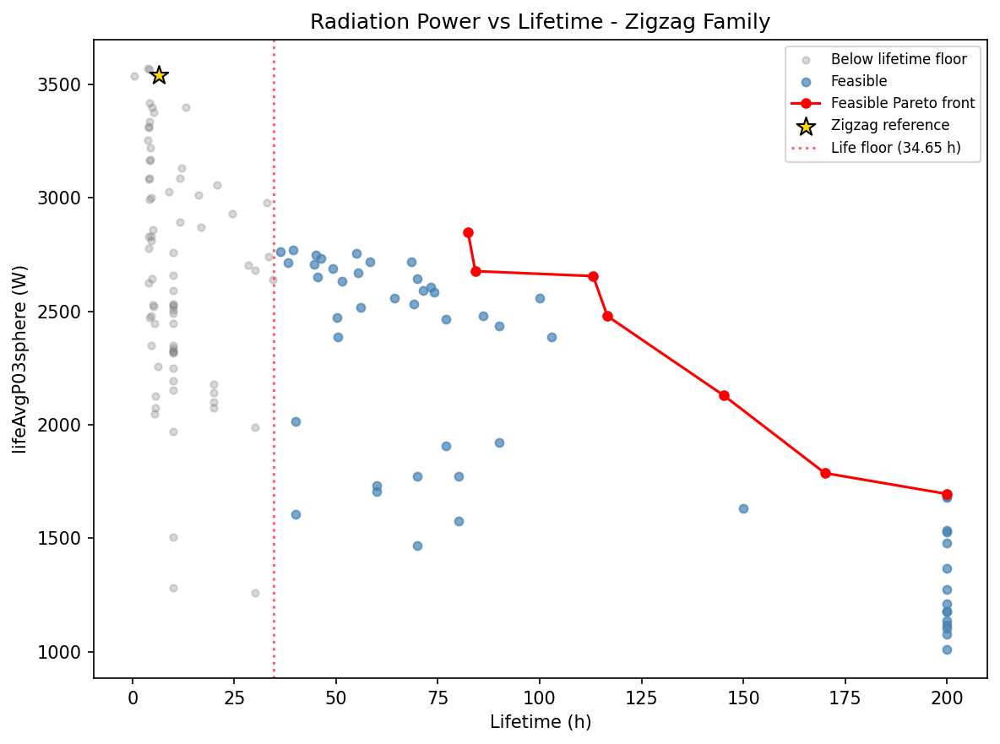

*图 4-8 zigzag 簇寿命-功率 Pareto 前沿*

图 4-8 与圆柱簇 Pareto 图的读法相同：横轴为寿命，纵轴为生命周期平均 0-3 um 外接球辐射功率。zigzag 结构由于路径更长、表面积更大，在纵轴上整体显著高于圆柱簇。但部分极高功率点寿命不足，不能作为可行解。Trial 21 位于寿命约束右侧且功率很高，说明它既保留了长路径拓扑的高辐射优势，又没有落入短寿命不可行区域。

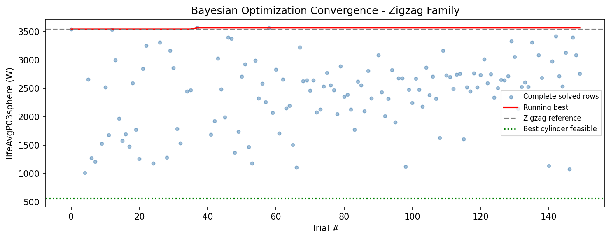

*图 4-9 zigzag 簇贝叶斯优化收敛曲线*

图 4-9 展示 150 组 zigzag 参数搜索过程中目标函数的变化。由于 zigzag 结构的几何更复杂，单个 trial 的建模、网格和 S2S 求解成本更高，因此不能依赖大规模暴力扫参。图中的历史最好曲线说明，贝叶斯优化能够在有限完整样本下发现高功率设计，并逐步把搜索集中到 `N_RUNS` 约为 10、`L_RUN` 约为 100 mm 的高潜力区域。

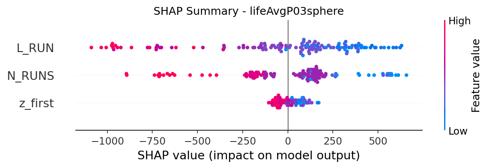

*图 4-10 zigzag 簇 `lifeAvgP03sphere_W` 的 SHAP summary 图*

图 4-10 用 SHAP 值解释每个参数对功率输出的贡献。横向位置表示该参数把预测功率推高还是压低，颜色表示参数取值大小。最终 150 组样本的随机森林分析显示，`L_RUN` 是影响 zigzag 功率输出的核心变量，AvgP03 模型中特征重要性约为 0.551；`N_RUNS` 次之，重要性约为 0.369；`z_first` 主要影响端部留白和温度分布，重要性约为 0.079。该结果与物理直觉一致：水平折返长度越大，导电路径越长、等体积截面越细、有效辐射面积越大，结构更容易形成高辐射输出。

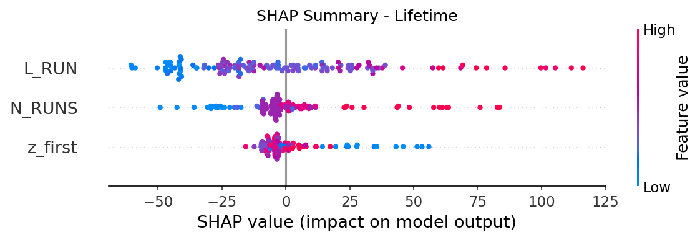

*图 4-11 zigzag 簇 `lifetimeH` 的 SHAP summary 图*

图 4-11 说明寿命同样主要受 `L_RUN` 控制。寿命代理模型中特征重要性约为：`L_RUN=0.541`、`N_RUNS=0.252`、`z_first=0.206`。这表明路径长度既是提升功率的主旋钮，也是影响退蚀寿命的主旋钮，因此 zigzag 的优化本质上是围绕路径长度、折返段数和端部高度分布寻找功率-寿命折中。

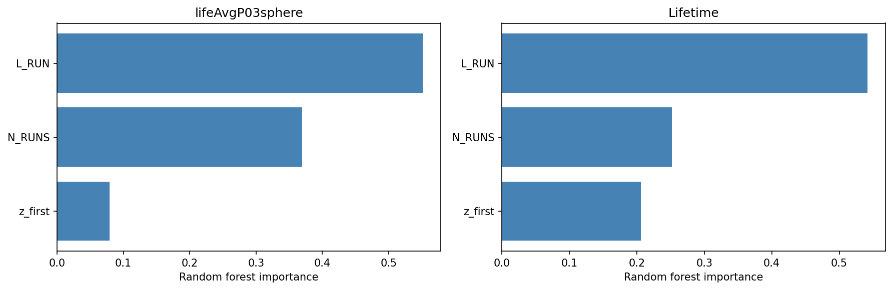

*图 4-12 zigzag 簇随机森林特征重要性*

图 4-12 从随机森林代理模型角度量化参数影响大小。完整 150 组数据下，AvgP03 代理模型 5-fold $R^2$ 为 0.543±0.303，寿命代理模型 5-fold $R^2$ 为 0.305±0.414。该精度足以支持趋势解释和下一轮候选建议，但最终候选排序仍以 COMSOL 生命周期仿真结果为准。

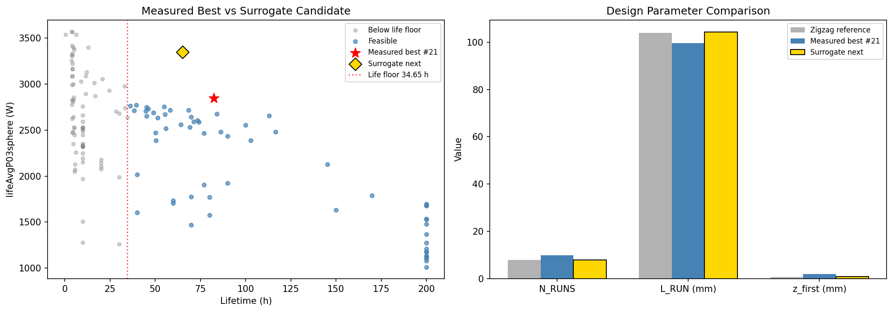

*图 4-13 zigzag 簇代理模型建议候选与实测最优候选对比*

代理模型在已有数据基础上给出的下一轮建议候选约为 `N_RUNS=8, L_RUN=104.2 mm, z_first=0.98 mm`，预测 AvgP03 约 3347.1 W、寿命约 65.22 h。该候选只作为后续局部加密搜索参考；当前提交采用的最优方案仍是已经完成 COMSOL 生命周期仿真的 Trial 21。

### 4.6 求解结果小结

圆柱簇和 zigzag 簇代表了两条不同层级的优化路线：圆柱簇是在原始轴向圆柱上做截面积重分配，主要提升来自局部电阻和热点控制。zigzag 簇则改变导电路径拓扑，通过显著拉长路径和增加辐射面积提升整体辐射能力。

| 对比项 | 均匀圆柱基线 | 圆柱簇最优可行解 | zigzag 最优可行解 |
|---|---:|---:|---:|
| 结构类型 | 圆柱基线 | 8 段圆柱簇 | 长路径折返拓扑 |
| trial 编号 | - | 122 | 21 |
| 核心参数 | `r=2.500 mm` | `[r1,r2,r3,r4]=[1.592,3.706,1.737,2.391] mm` | `N_RUNS=10, L_RUN=99.53 mm, z_first=2.04 mm, side=0.522 mm` |
| Vwork | 0.6348 V | 0.9766 V | 100 V |
| initialTmax | 3196.2 K | 3270.0 K | 2978.0 K |
| lifetimeH | 115.50 h | 35.27 h | 82.39 h |
| lifeAvgP03sphere_W | 428.57 W | 559.64 W | 2848.70 W |
| 相对圆柱基线提升 | 0% | +30.58% | +564.8% |
| 是否满足寿命约束 | 是 | 是 | 是 |

*表 4-7 最终候选与圆柱基线对比*

从结果上看，圆柱簇已经证明了局部截面重分配可以在低维参数空间内稳定提高目标函数。zigzag 簇则进一步证明了拓扑路径重构能显著抬高性能上限。两者不是互相替代关系，而是由低自由度可靠优化逐步走向高自由度拓扑创新的完整技术路线。

## 5. 算法性能分析

### 5.1 COMSOL 计算成本与贝叶斯优化效率

圆柱簇 150 条记录中，平均单次耗时约 291 s，总计算时间约 12 h。主要成本来自：

1. S2S view factor / radiosity 求解。
2. 电压二分搜索中的多次稳态求解。
3. 退蚀寿命循环中的几何更新和重复求解。

本文采用 `mph + COMSOLmphserver + JPype` 的长连接策略后，所有 trial 共享同一个 COMSOL server，避免反复启动 JVM 和 COMSOL 桌面的时间开销。

本项目没有采用均匀网格扫参，而是采用 Optuna TPE 贝叶斯优化，核心原因是单次评估非常昂贵：一个 trial 不只是一次稳态求解，还包括电压搜索、多次退蚀循环、几何重建和 S2S 辐射求解。如果采用粗网格搜索，圆柱簇 3 个独立半径变量即使每个变量只取 20 个点，也需要约 8000 次 COMSOL 生命周期评估。zigzag 的 `N_RUNS/L_RUN/z_first` 组合若按 7×50×40 粗扫，则超过 14000 次评估。这样的成本在初赛周期内不可接受。

贝叶斯优化的优势在于用少量高价值样本建立哪里值得继续试的概率模型。圆柱簇仅用 150 次评估就在 35 h 左右的寿命边界附近找到 +30.58% 的可行提升。zigzag 通过 150 次评估形成了 136 个可用于后处理的完整指标样本，并定位到 2848.70 W、82.39 h 的高性能可行解。也就是说，算法把计算预算集中在 Pareto 前沿附近，而不是平均浪费在低功率或明显不可行区域。

算法性能对比总结如下：

| 方法 | 评估方式 | 预计/实际计算量 | 适用性 |
|---|---|---:|---|
| 网格扫参 | 均匀枚举所有参数组合 | 数千到上万次 COMSOL 生命周期求解 | 成本过高 |
| 随机搜索 | 不利用历史样本 | 需要大量重复试错 | 可作为基线但效率低 |
| 贝叶斯优化 TPE | 根据历史 trial 自适应采样 | 圆柱 150 次、zigzag 150 次 | 本项目采用 |

因此，本项目的低成本不是降低单次物理模型精度，而是在保持 COMSOL 的前提下减少无效 trial 数。短时间性体现在可以在十余小时量级内完成一轮可解释、可复现、可提交的拓扑优化闭环。

### 5.2 代理模型精度

在圆柱簇 150 条样本和 zigzag 簇 136 条完整指标样本上训练随机森林回归模型。圆柱簇代理模型仅使用独立采样变量 \(r_1/r_2/r_3\)，不把体积守恒派生量 \(r_4\) 作为独立输入：

| 预测目标 | 5-fold R2 |
|---|---:|
| `lifeAvgP03sphere_W` | 0.550 ± 0.262 |
| `lifetimeH` | 0.040 ± 0.233 |

zigzag 代理模型使用 `N_RUNS/L_RUN/z_first` 三个独立变量：

| 预测目标 | 5-fold R2 |
|---|---:|
| `lifeAvgP03sphere_W` | 0.543 ± 0.303 |
| `lifetimeH` | 0.305 ± 0.414 |

采用独立变量口径后，圆柱簇功率代理模型能够捕捉主要设计趋势，但寿命代理的交叉验证分数较低；zigzag 功率与寿命代理模型均显示 `L_RUN` 是主导变量，说明路径长度是影响长路径拓扑功率-寿命折中的核心旋钮。由于寿命由 \(\exp(-B/T)\) 驱动，对局部表面温度、热点位置和退蚀步长高度敏感，我们将 RF/SHAP 明确定位为趋势解释和下一轮候选建议工具，不替代真实 COMSOL 生命周期仿真。

### 5.3 小结：坚持 BO 路线

本项目后续将继续采用贝叶斯优化（BO）作为主要搜索方法。原因是当前问题的核心瓶颈不是优化器本身，而是 COMSOL 生命周期评估成本高：每个 trial 都包含电压搜索、稳态电热辐射耦合、多步退蚀、几何重建和 S2S 辐射更新。BO 能在有限样本下利用历史 trial 信息，把新评估集中到高功率、寿命边界和 Pareto 前沿附近，适合当前低维、昂贵、确定性强的黑箱优化问题。

因此，我们不再把强化学习作为后续主线，而是沿 BO + COMSOL 高保真评估 + RF/SHAP 可解释分析的技术路线继续推进。下一阶段重点是在现有 BO 结果周围做局部加密搜索、补充寿命约束边界样本，并用代理模型解释参数趋势，而最终候选排序仍以 COMSOL 生命周期仿真结果为准。

## 6. 创新点

1. **体积守恒内嵌参数化**：圆柱簇通过半径平方和解析反算，保证候选几何等体积。
2. **COMSOL 无 GUI 黑箱优化**：基于 mph/JPype 保持 COMSOL server 长连接，直接服务 Optuna 批量搜索。
3. **AI 可解释性策略提取**：使用 RF/SHAP 从有限样本中总结粗细交替、边界寿命利用、长路径增表面积的设计规律。
4. **zigzag 长路径拓扑创新**：不同于圆柱簇仅在轴向重分配截面积，zigzag 在保持体积和电极位置不变的前提下主动拉长导电路径，使结构同时获得更高电阻、更大外表面积和更强 0-3 um 辐射能力。
5. **zigzag 性能机制可解释**：SHAP/RF 分析显示，`L_RUN` 是 zigzag 功率和寿命的主导变量。这一结论与物理直觉一致：水平长度决定路径总长、截面边长和等效辐射面积，从而决定功率-寿命折中。当前最优可行 zigzag 解达到 2848.70 W、82.39 h，相比圆柱簇最优可行解提升约 409%，说明拓扑路径重构比单纯半径重分配具有更高性能上限。

## 7. 待改进项

复赛阶段将围绕以下三点继续展开研究：

1. **退蚀全过程温度约束检查**：后续需在每个退蚀步记录最高温度并判定是否超温，避免初始可行但生命周期中后期局部超温的结构被误判为可行。
2. **selfViewLoss 校准**：当前圆柱簇基线的自遮挡偏差还不为0，源于系统偏差但不影响优化。后续可通过外接球直接积分或更高密度 view factor 复核进一步校准 `selfViewLoss` 
3. **细化zigzag 温度统计**：当前 zigzag 退蚀温度采用块中心高度抛物线近似，后续应升级为逐块侧面面积加权平均温度积分口径。
